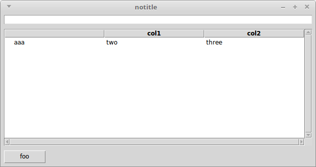
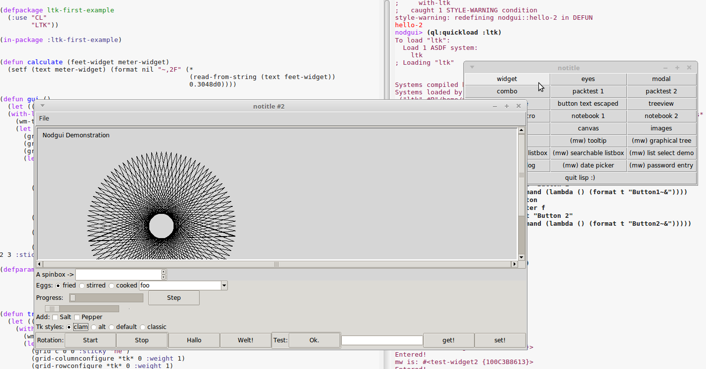

A noob trying out Tk GUIs in Common Lisp.

Nothing fancy, private tests, hopefully helping someone to getting
started, until they make it to a proper tutorial.

**NEW!** Peter Lane assembled an excellent resource for Ltk and Nodgui:

- https://peterlane.codeberg.page/ltk-examples/

# Quick Insights

How to create widgets: `(make-instance 'widget-name)`, for example

~~~lisp
(make-instance 'frame)
(make-instance 'treeview)
~~~

How to place them on the grid:

~~~lisp
;; (grid <widget> <column> <row> &options)
(grid c 0 0 :sticky "n" ;; north
            :padx 5 :pady 5)
~~~

The rest is discoverable !

https://gist.github.com/jasom/4c4bf02e60d85f2644f99ce7be5dce17

## Tree widget

~~~lisp
(make-instance 'treeview)
;; and
(treeview-insert c.tree :text "some text"))
~~~

With columns:

(commented sources)

A simple example:

~~~lisp
;; Always use with-nodgui or with-ltk.
(with-nodgui ()
    (let ((tree  (make-instance 'scrolled-treeview
                                ;; a treeview always has a first column.
                                :columns (list "col2"))))
      ;; We place our widget on the grid to see it.
      (grid tree 1 0)
      (loop for data in '("aaa" "bbb" "ccc")
         do (treeview-insert-item tree
                                  ;; text of the first column.
                                  :text data
                                  ;; text of the other columns.
                                  :column-values (list "val2")))))
~~~

For collapsable rows, the use of `parents` and `children`, an example: https://notabug.org/cage/nodgui/src/7e6da313d99d4b260aadab595fe4b0f843520da7/src/demo-tests.lisp

Another example showing a treeview, with columns, inserting content
from a searchbox, clearing the tree's content, and others (resizing,
etc): see `example-treeview-search-display`.

## Interactively building the GUI

http://www.peter-herth.de/ltk/ltkdoc/node8.html

run `(start-wish)` and start building interactively !

    (defparameter *button* (make-instance 'button :text "OK"))
    (grid *button* 1 0 :sticky "e")

and voilà, you didn't have to restart the main loop to see the new
button into the interface.

We didn't have to use the `with-ltk` macro too.

Then `(exit-wish)`.

## Demo

The nodgui demo shows a lot of widgets:

Try it out with

    (ql:quickload :nodgui)
    (nodgui.demo:demo)

# Links

- https://peterlane.codeberg.page/ltk-examples/ NEW(er) and awesome.
- https://github.com/LispCookbook/cl-cookbook/issues/31
- https://github.com/CodyReichert/awesome-cl#gui
- http://www.peter-herth.de/ltk/
- https://notabug.org/cage/nodgui.git = based on ltk with syntax sugar and more widgets (calendar, completion,…).

Tk tutorials used:

- https://tkdocs.com/tutorial/index.html
- https://www.effbot.org/tkinterbook/grid.htm

## Example apps

- https://github.com/lisp-mirror/fulci (by the author of nodgui)

