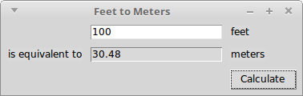
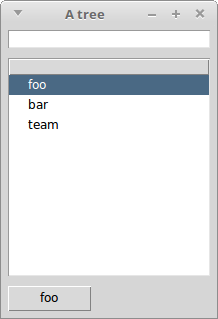

A noob trying out Tk GUIs in Common Lisp.

Nothing fancy, private tests, hopefully helping someone to getting
started, until they make it to a proper tutorial.

How to create widgets: `(make-instance 'widget-name)`, for example

~~~lisp
(make-instance 'frame)
(make-instance 'treeview)
~~~

How to place them on the grid:

~~~lisp
;; (grid <widget> <column> <row> &options)
(grid c 0 0 :sticky "n" ;; north
            :padx 5 :pady 5)
~~~

The rest is discoverable !

https://gist.github.com/jasom/4c4bf02e60d85f2644f99ce7be5dce17

~~~lisp
(make-instance 'treeview)
;; and
(treeview-insert c.tree :text "some text"))
~~~

# Links

- https://github.com/LispCookbook/cl-cookbook/issues/31
- https://github.com/CodyReichert/awesome-cl#gui
- http://www.peter-herth.de/ltk/
- https://notabug.org/cage/nodgui.git = based on ltk with syntax sugar and more widgets (calendar, completion,…).

Tk tutorials used:

- https://tkdocs.com/tutorial/index.html

## Example apps

- https://github.com/lisp-mirror/fulci (by the author of nodgui)

